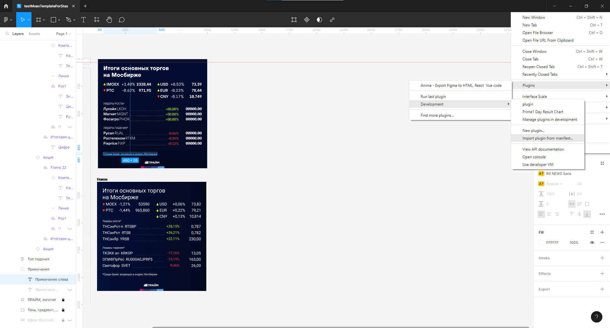
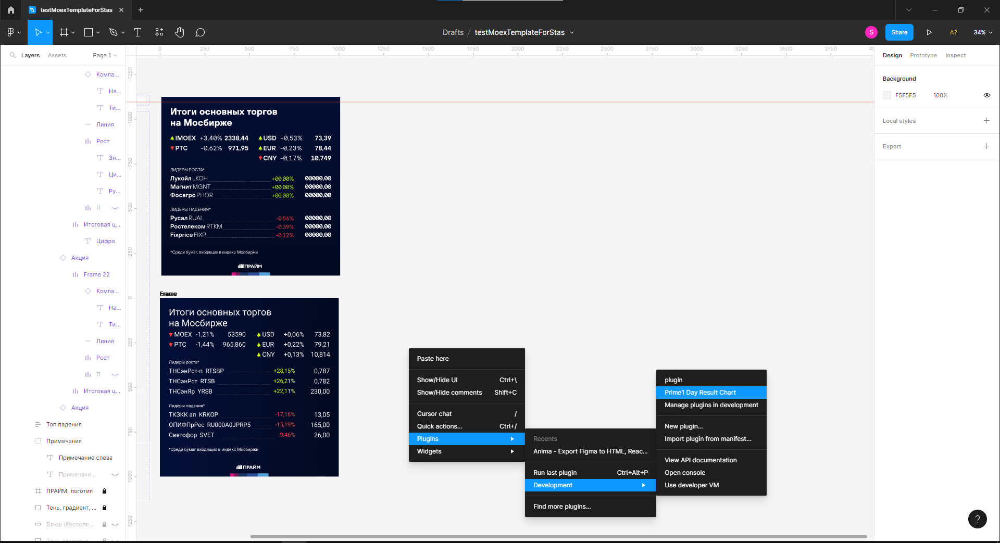

This Figma plugin helps you to draw MOEX trade results.

Installation
1. Clone project.
2. Import plugin into Figma with manifest
<code></code>
3. Launch plugin
<code></code>
4. Info will appear in a few seconds